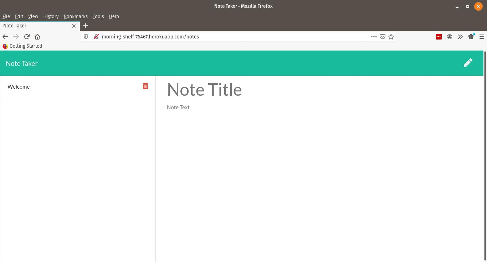

  # readme-generator

  ## Description

note-taker is a web application that stores notes to a server-side database. Notes are saved and recalled using express js.

  
  * [Installation](#installation)
  * [Usage](#usage)
  * [Credits](#Credits)
  * [License](#License)
  * [Questions](#questions)
  

## Installation

Clone the repository then run `npm install package.json` to make sure all dependencies are gotten. Server will need to be deployed for interaction.

## Usage

After the local files are cloned, start the server by using npm start. Once the site is running, navigate to http://localhost:3002. An introduction page will have a get started button which takes you to the notes page. After a note is created, clicking the save button will write the file to the local database. Previous notes can be recalled by clicking the corresponding title 

## Credits

http://github.com/mondrovic
      

## Inquiries

Any questions or inquiries can go to mondrovic1@gmail.com
Matthew Ondrovic
https://githbub.com/mondrovic
    
  
